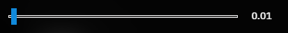

# Feature-Me-GUI
The GUI Collections from Feature Me
[Feature Me Repository](https://github.com/Feature-Me/Feature-Me-GUI)

UI Elements are avaliable in React,Vue,and normal HTML.

# How to use
This Repository does not include built code.Please build yourself.

# Features
+ Chamfered Button
+ Horizonal Selector
+ Range Input
+ Select Box

# Screenshots

## Chamfered Button

On hover:

On hover(colored):

 
---

## Horizonal Selector

Example usage: Select Anti Aliasing Mode

---

## Range Slider

Example usage: Volume Select

Large size(default)

Fit size

Tiny size

---

## Select box

Example usage: Language Select

Closed

Open

---

# Patch Notes

## 0.0.1
added button,horizonal,range,selectBox for react.
Created project.